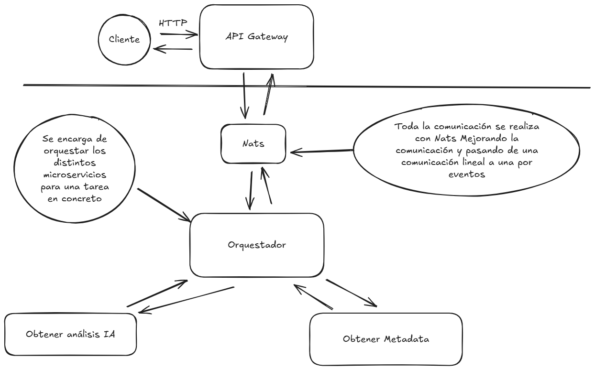

# Database Analyzer


> Herramienta modular y extensible para inspección, análisis y optimización de bases de datos, pensada para despliegues on‑premise y en la nube (arquitectura por microservicios).

## ¿Por qué Database Analyzer?

Con el crecimiento exponencial de los datos, las bases de datos se han convertido en el núcleo de las aplicaciones modernas. Sin embargo, muchas veces estas bases de datos no están optimizadas, lo que puede llevar a problemas de rendimiento y escalabilidad.
Database Analyzer surge como una solución integral para analizar y optimizar bases de datos de manera eficiente. A diferencia de otras herramientas, Database Analyzer ofrece:
- **Modularidad**: Arquitectura basada en microservicios que permite una fácil integración y escalabilidad.
- **Soporte Multibase de Datos**: Compatible con múltiples sistemas de gestión de bases de datos como MySQL, PostgreSQL, MariaDB, entre otros.
- **Análisis Profundo**: Evaluación exhaustiva del esquema, índices y patrones de consultas para identificar áreas de mejora.
- **Recomendaciones Prácticas**: Generación de informes detallados con sugerencias concretas para optimizar el rendimiento de la base de datos.
- **Despliegue Flexible**: Diseñado para funcionar tanto en entornos on-premise como en la nube, adaptándose a las necesidades específicas de cada organización.

## ¿Qué hace?

Database Analyzer analiza:

- Esquema y metadatos (tablas, columnas, constraints, FK...).
- Uso e historial de consultas (si se proporciona), para evaluar selectividad y patrones.
- Índices: detecta índices faltantes, superfluos o equivalentes.
- Recomendaciones prácticas (DDL sugerido, refactor de índices, hints sobre particionado/normalización).
- Generación de informes en JSON/HTML para tener una visión clara de posibles mejoras.

## Casos de uso

1. Auditoría periódica de bases de datos para equipos SRE / DBA.
2. Análisis general de la salud de la base de datos y optimización de la misma.

## Características

- Análisis de la estructura de la base de datos.
- Identificación de índices faltantes o innecesarios.
- Evaluación del rendimiento de las consultas ejecutadas anteriormente.
- Generación de informes detallados sobre el estado de la base de datos y recomendaciones de mejora.
- Soporte para múltiples sistemas de gestión de bases de datos (MySQL, PostgreSQL, MariaDB, etc.).
- API para integración con otros sistemas.
- Documentación Swagger para facilitar el uso y la integración.

## Estructura del repositorio (resumen operativo)

| Carpeta                  |                                                       Rol | Puertos/Notas                                    |
| ------------------------ | --------------------------------------------------------: | ------------------------------------------------ |
| `client-gateway/`        |                               Interfaz REST / API gateway | Exponer endpoints públicos y autenticación       |
| `metadata-service/`      |                    Recolección de metadatos desde las DBs | Conectores (Postgres, MySQL, MariaDB)            |
| `analysis-orchestrator/` |                       Orquestación y pipeline de análisis | Coordina trabajo entre servicios y NATS/RabbitMQ |
| `data/`                  | Datos de prueba para comprobar el correcto funcionamiento | Json con conexiones de ejemplo                   |

> Incluye `docker-compose.yml` y `docker-compose.prod.yml` para despliegue local y producción mínima.

<center>



</center>

## Quickstart (local, con Docker Compose)

1. Copiar plantilla de entorno:

```bash
cp .env.template .env
# Edita .env con credenciales de las DB que vas a analizar
```

2. Levantar servicios:

```bash
docker-compose up --build
```

3. Acceder a la documentación de la API mediate swagger: `http://localhost:3000/api/v1/doc`.

## Licencia

Este proyecto está licenciado bajo la Licencia AGPL-3.0. Consulta el archivo [LICENSE](./LICENSE) para más detalles.

## Créditos y Contacto

Este proyecto fue desarrollado por Arturo Carrillo Jimenez. Si tienes alguna pregunta o necesitas soporte, no dudes en contactarnos.

- **Autor**: Arturo Carrillo Jimenez
- **Email**: acarrilloj@gmail.com
- **GitHub**: [Github](https://github.com/ArturoCarrilloJimenez)
- **LinkedIn**: [LinkedIn](https://www.linkedin.com/in/arturo-carrillo/)

Contribuciones y sugerencias son bienvenidas. ¡Gracias por usar Database Analyzer!
